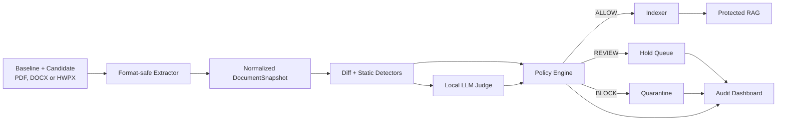

# 아키텍처와 GitHub 기본 구조

## 1. 기술 선택

24시간 MVP의 기본 선택은 다음과 같습니다.

- 언어: Python
- API: FastAPI
- 감사·데모 UI: Streamlit
- 모델: 외부 호출이 없는 로컬 LLM 어댑터
- 벡터 저장소: 하나의 로컬 저장소만 사용
- 테스트: pytest
- 코드 품질: Ruff

기술을 늘리는 것보다 모든 컴포넌트가 동일한 계약과 테스트 fixture를 사용하는 것이 우선입니다.

## 2. 목표 디렉터리 트리

```text
IndexGuard/
├─ README.md
├─ CONTRIBUTING.md
├─ pyproject.toml
├─ .env.example
├─ apps/
│  ├─ api/
│  │  └─ main.py
│  └─ dashboard/
│     └─ app.py
├─ src/indexguard/
│  ├─ __init__.py
│  ├─ contracts.py
│  ├─ pipeline.py
│  ├─ risk_engine.py
│  ├─ risk_api.py
│  ├─ security_policy.py
│  ├─ extractors/
│  │  ├─ base.py
│  │  ├─ pdf.py
│  │  ├─ docx.py
│  │  └─ hwpx.py
│  ├─ detectors/
│  │  ├─ document_diff.py
│  │  ├─ number_change.py
│  │  ├─ hidden_content.py
│  │  ├─ active_content.py
│  │  └─ prompt_injection.py
│  ├─ llm/
│  │  ├─ judge.py
│  │  └─ prompts/
│  │     └─ risk_judge.md
│  └─ rag/
│     ├─ indexer.py
│     └─ retriever.py
├─ tests/
│  ├─ unit/
│  ├─ integration/
│  ├─ e2e/
│  └─ fixtures/
│     ├─ pdf/
│     └─ hwpx/
├─ data/
│  ├─ samples/
│  │  ├─ normal/
│  │  └─ attacks/
│  └─ expected/
├─ scripts/
│  ├─ run_demo.ps1
│  └─ evaluate.py
├─ docs/
└─ .github/
   ├─ workflows/
   │  └─ ci.yml
   └─ pull_request_template.md
```

`pyproject.toml`, 실행 앱, CI는 각 기능의 첫 구현 PR에서 함께 추가합니다. 지금 문서에 없는 새 최상위 디렉터리는 제품 리드 승인 없이 만들지 않습니다.

## 3. 실행 흐름



보안 경계는 `Policy Engine -> Indexer` 사이입니다. 대시보드, 추출기, LLM은 색인기를 직접 호출할 수 없습니다.

## 4. 내부 정규화 계약

입력 형식의 차이는 추출기에서 끝내고 이후 단계는 같은 `DocumentSnapshot`을 받습니다.

```python
DocumentSnapshot(
    document_id="policy-v2",
    format="HWPX",
    sha256="...",
    text="...",
    units=[
        TextUnit(
            id="section0:p18273645:r3",
            text="승인 기준은 1억 원이다.",
            location={"section": 0, "paragraph_id": "18273645"},
            style={"char_pr_id": "17", "color": "#FFFFFF"},
            visibility="HIDDEN_SUSPECTED",
        )
    ],
    artifacts=["SCRIPT"],
)
```

필수 원칙:

- 위치 정보는 PDF 페이지 또는 HWPX section/paragraph/run 수준으로 보존합니다.
- 정규화 텍스트와 숨김 의심 텍스트를 버리지 않습니다.
- HWPX 보조 XML의 텍스트는 보안 evidence로 보존하되 RAG용 본문 순서에는 섞지 않습니다.
- 모든 finding은 가능한 경우 원본 위치를 가집니다.
- 파일 해시와 파서 버전을 감사 로그에 남깁니다.
- 원본 문서는 임베딩 함수에 직접 전달하지 않습니다.

## 5. 컴포넌트 책임

| 컴포넌트 | 책임 | 하지 않는 일 |
|---|---|---|
| `extractors` | 안전한 파일 검증, 텍스트·구조·스타일 추출 | 위험 최종 판정 |
| `detectors` | Diff와 재현 가능한 정적 finding 생성 | 직접 색인·격리 |
| `risk_engine.py` | 정적 finding, 선택적 LLM 판정, 고위험 2차 감사 | 원본 파일·RAG·C 명령 접근 |
| `risk_api.py` | 독립 B `/analyze`, bearer 인증, fail-closed 응답 | A 내부 상태 변경 |
| `openai_compat.py` | 격리된 모델 요청과 JSON 근거 생성 | hard-block 해제·도구 실행 |
| `rag/indexer.py` | `ALLOW + INDEX` 문서만 저장 | 자체 판단 |
| `apps/api` | 업로드, 오케스트레이션, 응답 | 분석 로직 중복 구현 |
| `apps/dashboard` | 결과·근거·RAG 비교 표시 | 백엔드 규칙 재구현 |

## 6. 색인 안전장치

색인 함수는 분석 결과 전체를 입력받고 아래 조건을 다시 검사해야 합니다.

```python
if result.decision != "ALLOW" or result.index_action != "INDEX":
    raise IndexDenied(result.decision, result.index_action)
```

UI에서 버튼을 숨기는 것만으로는 차단이 아닙니다. E2E 테스트는 공격 문서 분석 후 벡터 저장소의 해당 `document_id` 청크 수가 `0`인지 확인해야 합니다.

## 7. 소유권과 충돌 방지

| 경로 | 주 담당 | 변경 시 확인 대상 |
|---|---|---|
| `src/indexguard/extractors`, `detectors/document_diff.py`, `rag/gate.py`, `apps/api` | A 문서 게이트웨이 | AI 리드의 fixture 기대값 |
| `apps/dashboard`, `README.md`, 배포 파일 | 제품·기획 리드 | API 계약 |
| `src/indexguard/llm`, 위험 탐지기, `tests/fixtures`, `data`, 평가 스크립트 | AI·레드팀 리드 | 공통 finding enum |
| `contracts.py`, `docs/API_CONTRACT.md` | 공동 잠금 | 세 명 모두 |

`contracts.py`와 `API_CONTRACT.md`는 H1 이후 임의 변경하지 않습니다. 변경이 필요하면 소비자 코드와 fixture를 같은 PR에서 함께 고칩니다.
